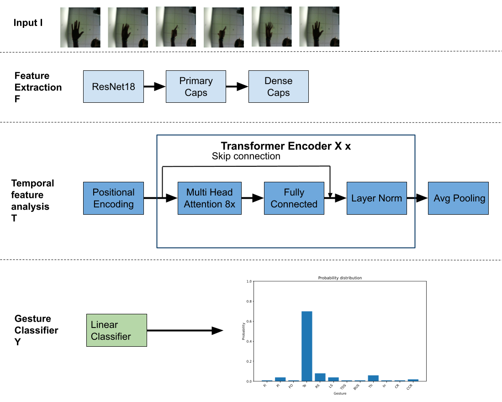
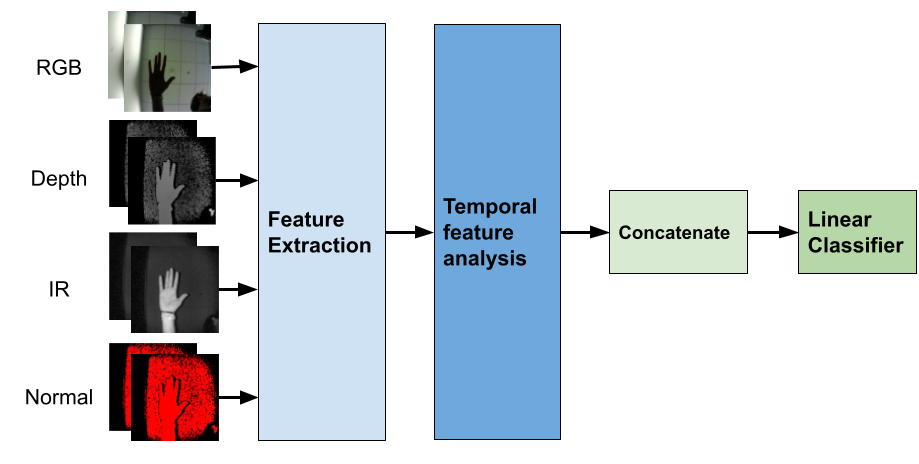

# CAPSULES NETWORK WITH TEMPORAL ATTENTION FOR VIDEO HAND GESTURE RECOGNITION

This model can be divided into two part. The first is the spatial features analysis using Capsules Network. 
The second is the temporal features analysis using Transformers.

The model can be summarized as follows: 


# CNN_Transformers

This is our implementation of the following paper "*A. D’Eusanio, A. Simoni, S. Pini, G. Borghi, R. Vezzani, R. Cucchiara*  
**A Transformer-Based Network for Dynamic Hand Gesture Recognition**  
*In International Conference on 3D Vision (3DV) 2020*"

# CapsNet_Transformers

This is the basic model presented in the paper. It uses network capsules for spatial analysis and transformers for temporal analysis.

# features_fusion

It's the implementation of the features fusion presented in the paper for a multimodal analysis. The features fusion can be summarized as follows: 


# probabilty_fusion

It's the implementation of the probabilty fusion presented in the paper for a multimodal analysis. 

# Getting Started
Things you need to install to run the code:

```
Python >= 3.8
PyTorch == 1.12
```
Install [CUDA](https://developer.nvidia.com/cuda-zone) and [PyTorch](https://pytorch.org/) following the main website directive.

Then run the command: 
```
pip install -r requirements.txt
```

# Download Datasets
The employed datasets are publicy available: 
- **[Briareo](https://aimagelab.ing.unimore.it/imagelab/page.asp?IdPage=31 "Briareo Dataset")**
- **[SHREC17](http://www-rech.telecom-lille.fr/shrec2017-hand/")**

For SHREC17 in order to get the CSV files used in our project you must run the command on the notebook presents in the utils folder.

# Setup configuration
For this project we used a json file, located in the hyperparameters folder: 

In this file, you can set several hyperparameters, like:

- **Dataset**, Briareo or SHREC17.
- **phase**, select if training or testing.
- **Data-type**, select which source is used: depth, rgb, ir, surface normals or optical-flow.
- **Data-Nframe**, length of the input sequence, default: 40 frame.
- **Data-path**, path where you downloaded and unzipped the dataset.
- **Path of others models**, path where the others models are saved for the features and probability fusions. 

For the others hyperparameters please refer to the json file.

# Train the model

To train the model you must run the following command:
```
python main.py --hypes=hyperparameters/choosen_dataset/train.json
```

# Test the model
To test the model you must run the following command:
```
python main.py --hypes=hyperparameters/choosen_dataset/train.json --phase=test --resume=path_to_checkpoint
```
